# 🔍 KCD-Web Threat Hunt — Sysmon Log Analysis in Splunk Cloud

A full threat-hunting investigation into a compromised Windows host (`KCD-Web`, `172.16.1.7`), performed entirely in **Splunk Cloud** against a **Sysmon CSV export**. The investigation traces the attacker from initial RDP brute-force access through dropper staging, fake-service persistence, C2 beaconing, defense evasion, and a headless-browser credential farm.

Every phase below shows the exact SPL query run, the reasoning behind the pivot, and the actual Splunk / VirusTotal screenshot from that step.

---

## 📌 TL;DR

| | |
|---|---|
| **Victim host** | `KCD-Web` (`172.16.1.7`) |
| **Log source** | Sysmon (`Microsoft-Windows-Sysmon/Operational`), exported to CSV |
| **Platform** | Splunk Cloud (`index=main`, `sourcetype=csv`) |
| **Root cause** | RDP brute force → interactive PowerShell download → multi-stage dropper chain |
| **Persistence** | Fake Windows service `WindowsDefend` (typosquat of Windows Defender) |
| **Payload** | `wasp.exe` infostealer + `waspwing.exe` headless Chromium browser farm |
| **C2** | `185.213.157.164:10066` (primary), plus HTTP beacons to ~10 external IPs |
| **Confirmed malicious** | `wasp.exe` (38/71 VT), `svchost.exe`/ServiceE (16/71 VT) |

---

## ⚠️ A note on data ingestion (read this first)

The raw Sysmon export (`KCD.csv-2026-4-8 14.52.1.csv`) was **too large to upload directly through the Splunk Cloud web UI** — the browser-based "Add Data" upload has practical size limits and rejects/times out on large single-file uploads.

To get the data into the `main` index, a **Splunk Universal Forwarder** was used instead:

1. Installed the Universal Forwarder on the machine hosting the CSV export.
2. Configured `inputs.conf` to monitor the file and forward it to the Splunk Cloud indexers.
3. Set `sourcetype=csv` on ingestion and let the forwarder stream the file in, rather than pushing it through the browser upload path.
4. Verified ingestion completeness with `index="main" source="G:\\KCD.csv-2026-4-8 14.52.1.csv" | stats count` before starting the hunt.

This is why every query below references the exact CSV path as `source=` — it's the literal monitored file path from the forwarder's `inputs.conf`, not an uploaded filename.

**Takeaway:** for large one-off CSV/log dumps that exceed the UI upload limit, use a Universal Forwarder (or HEC) instead of the web upload flow.

---

## 🗂️ Repo structure

```
KCD-Web-Threat-Hunt/
├── README.md                 ← full investigation, every screenshot embedded (this file)
├── docs/                     ← same content split by topic, for reference/linking
│   ├── data-ingestion.md
│   ├── investigation-report.md
│   ├── timeline.md
│   ├── ioc-list.md
│   └── mitre-attack-mapping.md
├── spl-queries/
│   └── all-queries.spl       ← every SPL query, in order, commented
└── screenshots/               ← source images, organized by phase
```

---

## PHASE 1 — Initial Data Exploration & Baseline Understanding

### Step 1.1 — Sysmon EventCode Distribution

**Objective:** identify which event types dominate the dataset and which can be safely filtered as noise.

```spl
index="main" source="G:\\KCD.csv-2026-4-8 14.52.1.csv"
| stats count by EventCode
| sort - count
```

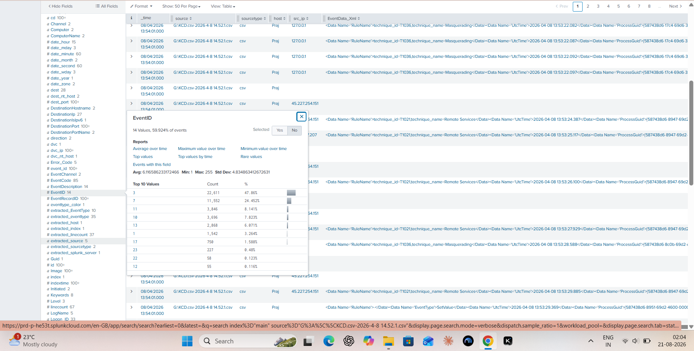

| EventCode | Description | Count | % |
|---|---|---|---|
| 3 | Network Connection | 29,039 | 50.14% |
| 7 | Image Loaded (DLL) | 13,352 | 23.05% |
| 10 | Process Access | 4,671 | 8.07% |
| 11 | File Create | 4,112 | 7.10% |
| 13 | Registry Value Set | 3,527 | 6.09% |
| 1 | Process Creation | 1,843 | 3.18% |
| 17 | Named Pipe Created | 931 | 1.61% |
| 23 | File Delete | 247 | 0.43% |
| 22 | DNS Query | 71 | 0.12% |

**Decision:** EventCode 7 (Image Loaded) is the safest to filter out for noise reduction. EventCodes 1, 3, 11, 13 retained as high-value.

### Step 1.2 — Destination IP & Source IP Distribution

**Objective:** identify internal vs. external traffic patterns before hunting for anomalies.

```spl
index="main" source="G:\\KCD.csv-2026-4-8 14.52.1.csv" EventCode=3
| stats count by DestinationIp
| sort - count
```

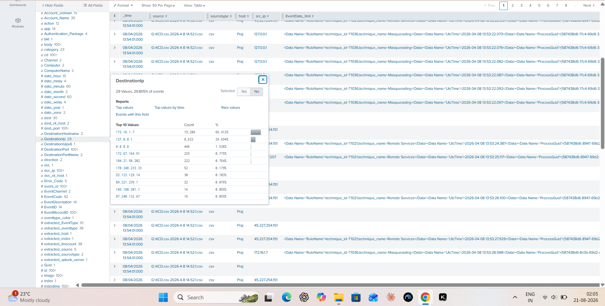

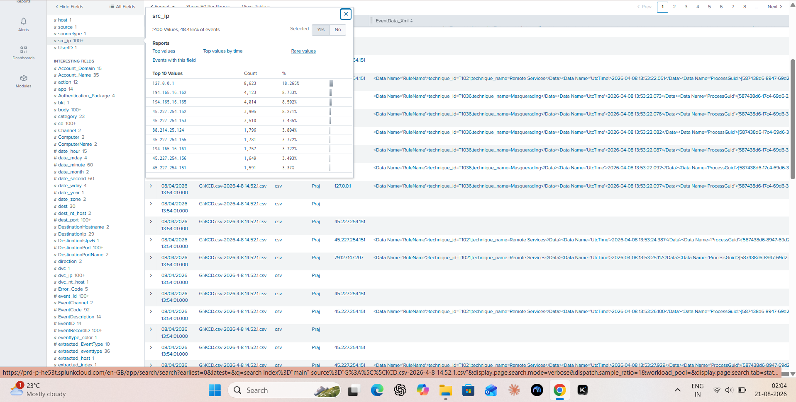

| DestinationIp | Count | % | Classification |
|---|---|---|---|
| 172.16.1.7 | 19,286 | 66.41% | Internal (RFC 1918) |
| 127.0.0.1 | 8,623 | 29.69% | Loopback |
| 8.8.8.8 | 446 | 1.54% | Google DNS (benign) |
| 172.67.164.91 | 225 | 0.77% | Cloudflare CDN |
| 104.21.58.202 | 222 | 0.76% | Cloudflare CDN |
| 178.248.233.33 | 52 | 0.18% | Suspicious external |
| 52.123.129.14 | 30 | 0.10% | Microsoft Azure |
| 89.221.239.1 | 22 | 0.08% | Suspicious external |
| 185.180.201.1 | 16 | 0.06% | Suspicious external |
| 87.240.132.67 | 16 | 0.06% | Suspicious external |

**Key learning:** ~96% of traffic is internal noise. Threats hide in the <1% "long tail" of rare external IPs — that's exactly where the hunt focused.

---

## PHASE 2 — Noise Filtering & Internal/External Classification

**Objective:** remove internal and loopback noise to focus on external threats.

```spl
index="main" source="G:\\KCD.csv-2026-4-8 14.52.1.csv" EventCode=3
NOT (DestinationIp IN ("172.16.1.7", "127.0.0.1"))
| stats count values(Image) as Process values(DestinationPort) as Ports by DestinationIp
| sort - count
```

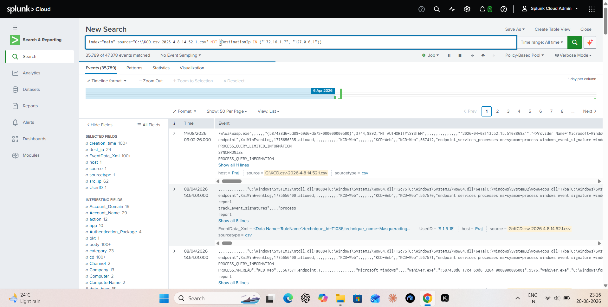

**Methodology note:** exact IP matching via `IN()` was used instead of a broad `172.*` wildcard, to avoid accidentally filtering out the legitimate Cloudflare CDN IP `172.67.164.91`.

A CIDR-based tagging query was also used to auto-classify every IP:

```spl
index="main" source="G:\\KCD.csv-2026-4-8 14.52.1.csv" EventCode=3
| eval IP_Type = case(
    cidrmatch("10.0.0.0/8", DestinationIp), "Internal",
    cidrmatch("172.16.0.0/12", DestinationIp), "Internal",
    cidrmatch("192.168.0.0/16", DestinationIp), "Internal",
    cidrmatch("127.0.0.0/8", DestinationIp), "Localhost",
    true(), "External"
)
| search IP_Type="External"
| stats count values(Image) as Process values(DestinationPort) as Ports by DestinationIp
| sort - count
```

---

## PHASE 3 — Malware Discovery: `wasp.exe`

**Objective:** investigate process creation events for `wasp.exe`, first spotted while pivoting on Delphi/EurekaLog packer signatures.

```spl
index="main" source="G:\\KCD.csv-2026-4-8 14.52.1.csv" EventCode=1 Image="*wasp.exe*"
| table _time, Computer, User, ParentImage, ParentCommandLine, Image, CommandLine, Hashes
```

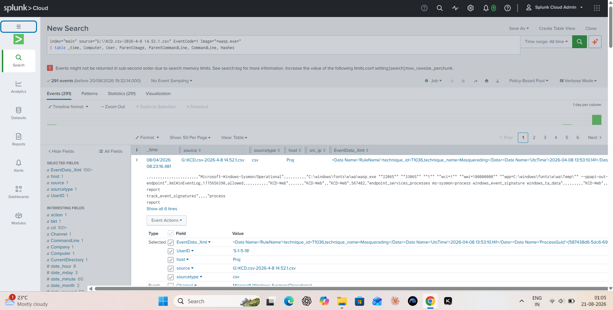

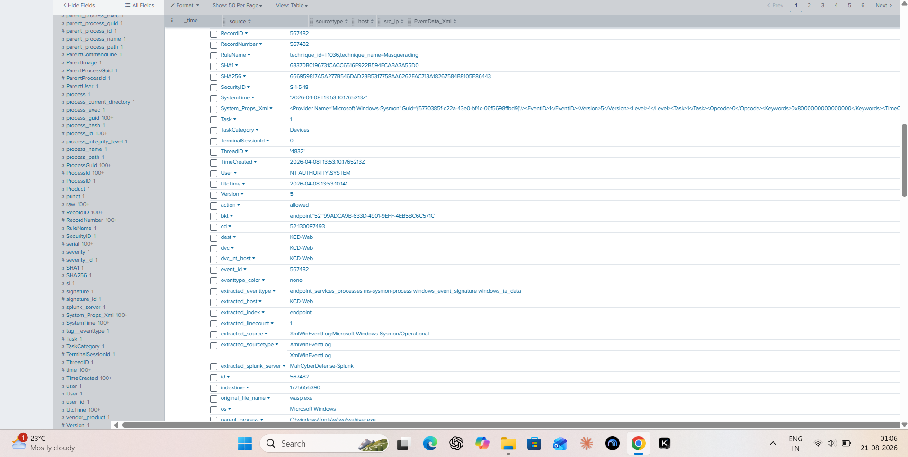

**Critical findings:**

| Field | Value |
|---|---|
| Image | `C:\Windows\Fonts\w\wa\wasp.exe` |
| User | `NT AUTHORITY\SYSTEM` |
| ParentImage | `C:\Windows\Fonts\w\wa\wahiver.exe` |
| IntegrityLevel | System |
| SHA256 | `666959817A5A277B546DAD23B5317758AA6262FAC713A18267584B8105E86443` |
| MD5 | `E93ECC5D23CA7DBEC00712B735D6821B` |
| MITRE Technique | T1036 (Masquerading) |
| VirusTotal | Confirmed malicious |

**Red flags identified:**
- Binary located in `C:\Windows\Fonts\w\wa\` — not a legitimate Windows path.
- Running as `NT AUTHORITY\SYSTEM` (highest privilege).
- Command line registers fake Chromium plugins with deliberate typos (e.g. `application/x-shockwave-flasn`).
- Sysmon's own `RuleName` field flagged it: `technique_id=T1036,technique_name=Masquerading`.

**VirusTotal confirmation:**

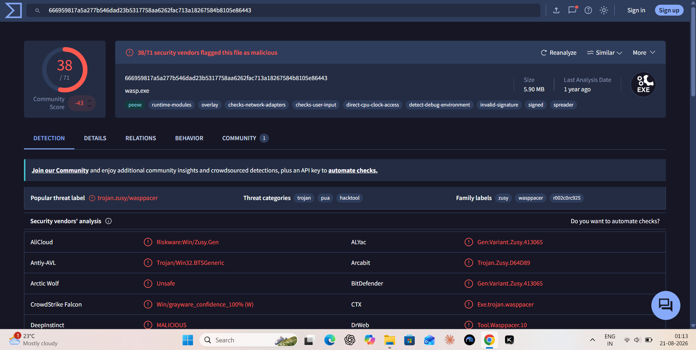

`wasp.exe` (SHA256 `666959817a5a277b546dad23b5317758aa6262fac713a18267584b8105e86443`) was flagged malicious by **38 of 71** security vendors, threat label `trojan.zusy/wasppacer` (family labels: `zusy`, `wasppacer`; categories: trojan, PUA, hacktool).

---

## PHASE 4 — Parent Process Investigation: `wahiver.exe`

**Objective:** identify what spawned `wasp.exe`.

```spl
index="main" source="G:\\KCD.csv-2026-4-8 14.52.1.csv" EventCode=1
(Image="*wahiver.exe*" OR ProcessGuid="{587438d6-17c4-69d6-3264-000000000500}")
| table _time, Computer, ParentImage, ParentCommandLine, Image, CommandLine, Hashes
```

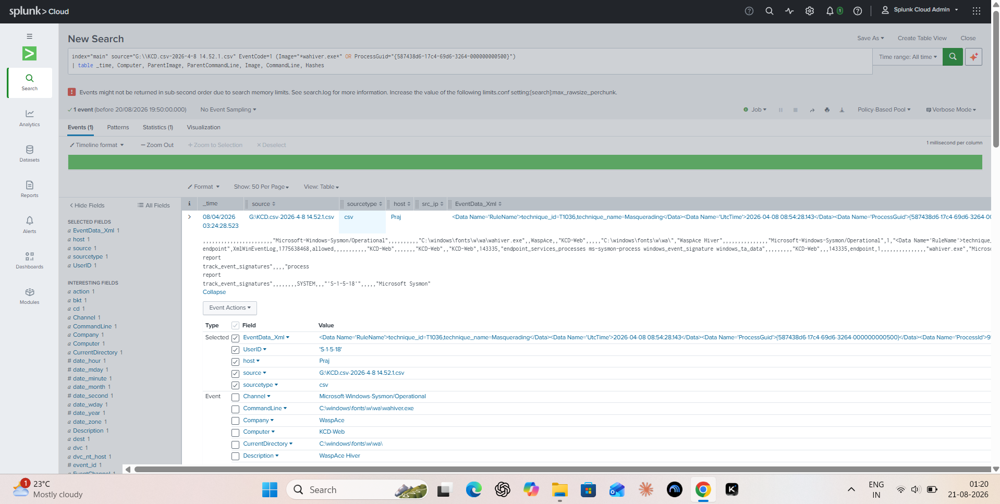

| Field | Value |
|---|---|
| Image | `C:\Windows\Fonts\w\wa\wahiver.exe` |
| Description | WaspAce Hiver |
| User | `NT AUTHORITY\SYSTEM` |
| ParentImage | `C:\Windows\Fonts\w\svchost.exe` |
| ParentCommandLine | `C:\Windows\fonts\w\svchost.exe run` |
| SHA256 | `AF60E17891BE5F4E6A777056F539B9ACFC4C695F7D781E131FD3F795EF0A60B9` |
| IMPHASH | `00000000000000000000000000000000` (packed/obfuscated) |

**Network activity (C2):**

```spl
index="main" source="G:\\KCD.csv-2026-4-8 14.52.1.csv" EventCode=3 Image="*wahiver.exe*"
NOT (DestinationIp IN ("127.0.0.1", "172.16.*"))
| table _time, Image, DestinationIp, DestinationPort
| sort _time
```

| DestinationIp | Port | Role |
|---|---|---|
| 185.213.157.164 | 10066 | Primary C2 (non-standard port) |
| 178.248.233.33 | 80 | Beaconing / dead-drop resolver |
| 185.180.201.1 | 80 | Secondary C2 |
| 89.221.239.1 | 80 | Secondary C2 |
| 90.156.232.4 | 80 | Secondary C2 |
| 93.186.225.194 | 80 | Secondary C2 |
| 87.240.132.67 / .72 / .78 / 129.133 / 137.164 | 80 | VKontakte IP range beacons |

**Dwell time:** beaconing observed as early as **2026-04-05**, indicating 3+ days of persistence before discovery on 2026-04-08.

**Loopback (`127.0.0.1`) IPC connections:**

```spl
index="main" source="G:\\KCD.csv-2026-4-8 14.52.1.csv" EventCode=3
ProcessGuid="{587438d6-5dc6-69d6-e572-000000000500}"
| table _time, SourceIp, DestinationIp, DestinationPort, DestinationHostname
```

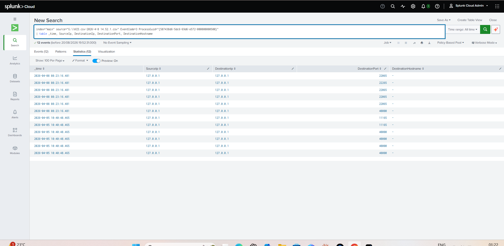

| SourceIp | DestinationIp | Port | Purpose |
|---|---|---|---|
| 127.0.0.1 | 127.0.0.1 | 22065 | IPC (`wasp.exe` ↔ `wahiver.exe`) |
| 127.0.0.1 | 127.0.0.1 | 22265 | IPC |
| 127.0.0.1 | 127.0.0.1 | 40000 | Local proxy / data staging |
| 127.0.0.1 | 127.0.0.1 | 11165 | IPC |

**Explanation:** port `22065` was passed as a command-line argument to `wasp.exe` by `wahiver.exe` — IPC used to move stolen data between malware components while evading perimeter firewalls that ignore localhost traffic.

---

## PHASE 5 — Persistence Mechanism Discovery

**Objective:** identify how the malware survives reboots.

```spl
index="main" source="G:\\KCD.csv-2026-4-8 14.52.1.csv" (EventCode=12 OR EventCode=13)
(TargetObject="*wahiver*" OR TargetObject="*wasp*" OR Details="*wahiver*" OR Details="*wasp*" OR TargetObject="*WindowsDefend*")
| table _time, EventCode, User, Image, TargetObject, Details
```

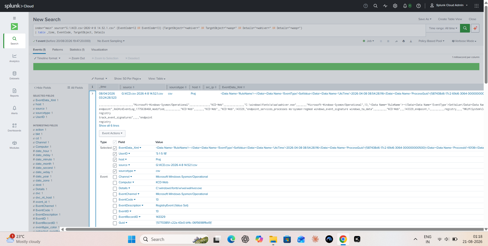

| Registry Key | Value |
|---|---|
| `HKLM\System\CurrentControlSet\Services\WindowsDefend\Parameters\Application` | `C:\windows\fonts\w\wa\wahiver.exe` |
| `HKLM\System\CurrentControlSet\Services\WindowsDefend\Parameters\AppDirectory` | `C:\windows\fonts\w\wa` |
| `HKLM\System\CurrentControlSet\Services\WindowsDefend\Parameters\AppParameters` | (empty) |

**Analysis:** the attacker created a fake Windows service named **`WindowsDefend`** — a deliberate typosquat of "Windows Defender" (missing the "er") — to masquerade as legitimate Microsoft security software.

---

## PHASE 6 — Full Execution Chain Reconstruction

### The fake `svchost.exe` (service installer)

```spl
index="main" source="G:\\KCD.csv-2026-4-8 14.52.1.csv"
(Image="*\\fonts\\w\\svchost.exe*" OR ParentImage="*\\fonts\\w\\svchost.exe*")
| table _time, EventCode, User, Image, CommandLine, DestinationIp
```

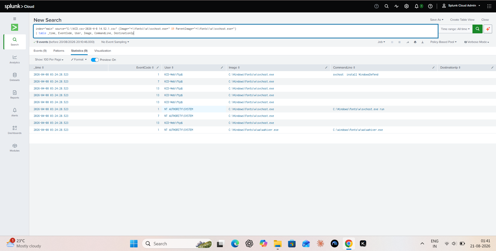

| Field | Value |
|---|---|
| Image | `C:\Windows\Fonts\w\svchost.exe` |
| Real identity | ServiceEx console application (`OriginalFileName: ServiceE.exe`) |
| SHA256 | `9BD14131C0629461D045712A78F5ADFE64947C922577C924694A9B122BE28E70` |
| Signed | No |
| MITRE | T1036 (Masquerading), T1574.002 (DLL Side-Loading) |

**Execution sequence:**
1. `svchost install WindowsDefend` → creates the malicious service (user: `ftp$`)
2. `services.exe` → `svchost.exe run` → launches as `NT AUTHORITY\SYSTEM`
3. `svchost.exe run` → spawns `wahiver.exe` → spawns `wasp.exe`

**VirusTotal confirmation for the ServiceEx binary:**

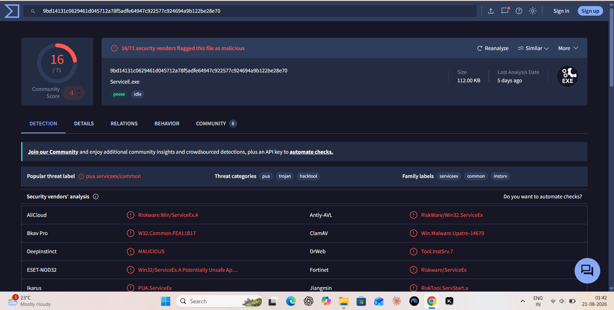

SHA `9bd14131c0629461d045712a78f5adfe64947c922577c924694a9b122be28e70` (`ServiceE.exe`) was flagged by **16 of 71** vendors — threat label `pua.serviceex/common`.

### Tracing `go.bat` origin (PID 8896)

```spl
index="main" source="G:\\KCD.csv-2026-4-8 14.52.1.csv" EventCode=1
(ProcessId=8896 OR ProcessGuid="{587438d6-17c2-69d6-2864-000000000500}")
| table _time, User, ParentImage, ParentCommandLine, Image, CommandLine
```

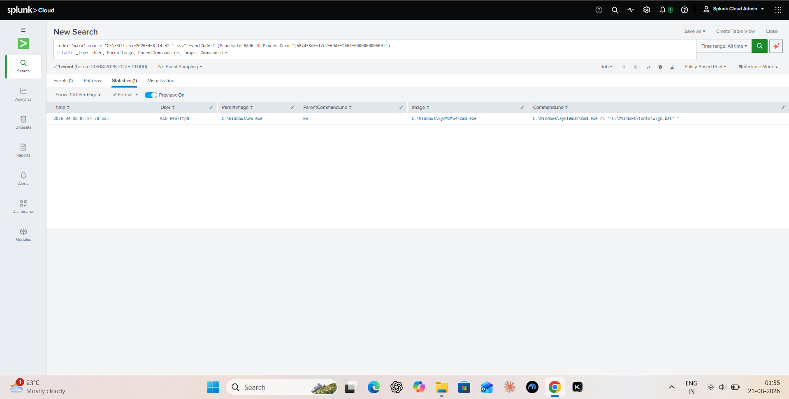

**Finding:** `C:\Windows\ww.exe` launched `C:\Windows\system32\cmd.exe /c ""C:\Windows\fonts\w\go.bat""`.

### File creation timeline (droppers → SFX archives)

```spl
index="main" source="G:\\KCD.csv-2026-4-8 14.52.1.csv" EventCode=11 TargetFilename="*go.bat*"
| table _time, User, Image, TargetFilename
```

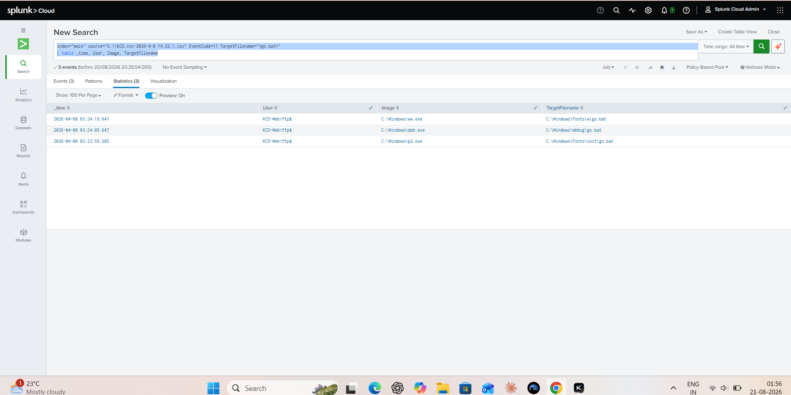

```spl
index="main" source="G:\\KCD.csv-2026-4-8 14.52.1.csv" EventCode=11 TargetFilename="*\\Windows\\Fonts\\w\\*"
| table _time, Image, TargetFilename, ProcessGuid
```

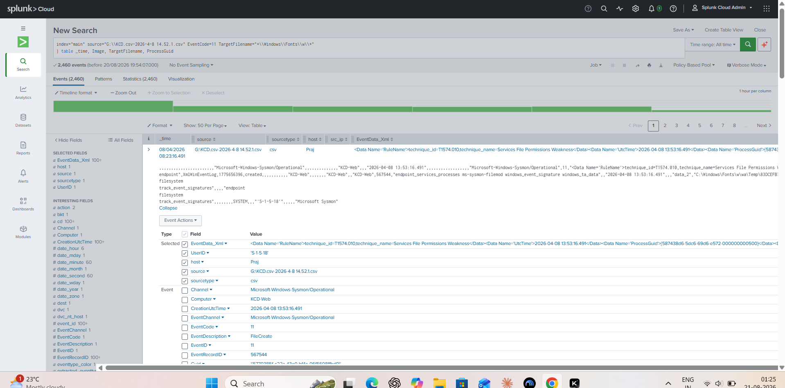

```spl
index="main" source="G:\\KCD.csv-2026-4-8 14.52.1.csv" EventCode=11 User="*ftp*"
| table _time, Computer, User, Image, TargetFilename
| sort _time
```

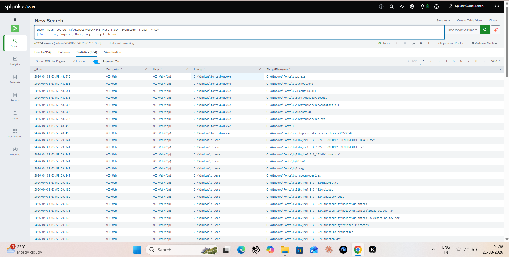

| Time | Dropper | File Created |
|---|---|---|
| 03:23:59 | `C:\Windows\p2.exe` | `C:\Windows\Fonts\init\go.bat` |
| 03:24:09 | `C:\Windows\deb.exe` | `C:\Windows\debug\go.bat` |
| 03:24:19 | `C:\Windows\ww.exe` | `C:\Windows\Fonts\w\go.bat` |
| 03:24:28 | `go.bat` → `cmd.exe` | Service installation triggered |
| 03:59:27 | `C:\Windows\b1.exe` | Full Java JRE + `brute.properties` + `00.bat` + `1.reg` |
| 03:59:48 | `C:\Windows\fonts\b\u.exe` | `AlwaysUpService.exe` + DLLs + `Up.exe` |

**Key discovery:** `__tmp_rar_sfx_access_check` marker files prove `b1.exe` and `u.exe` are **WinRAR Self-Extracting (SFX) archives**, used to smuggle full toolkits (bundled JRE, brute-force config, a repurposed "AlwaysUp" service wrapper for persistence) onto disk in one shot.

---

## PHASE 7 — Initial Access & Lateral Movement

### PowerShell stager download

```spl
index="main" source="G:\\KCD.csv-2026-4-8 14.52.1.csv" EventCode=1 Image="*powershell.exe*"
| table _time, User, CommandLine, ParentImage
```

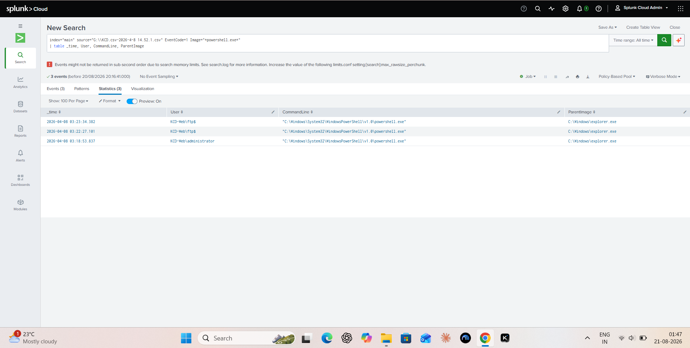

| Time | User | ParentImage | Note |
|---|---|---|---|
| 03:18:53 | `KCD-Web\administrator` | `explorer.exe` | Interactive GUI session |
| 03:22:27 | `KCD-Web\ftp$` | `explorer.exe` | Interactive GUI session |
| 03:23:34 | `KCD-Web\ftp$` | `explorer.exe` | Interactive GUI session |

**Critical note:** `ParentImage = explorer.exe` proves the attacker had an **interactive RDP session** and manually opened PowerShell — hands-on-keyboard, not fileless/remote-exec. Network correlation showed `powershell.exe` connecting to `82.147.85.6:80` at `03:22:45` to download the malware bundle.

### Windows logon correlation attempt (documented limitation)

```spl
index="main" source="G:\\KCD.csv-2026-4-8 14.52.1.csv" (EventCode=4624 OR EventID=4624)
(User="*ftp*" OR User="*administrator*" OR TargetUserName="*ftp*" OR TargetUserName="*administrator*")
| table _time, TargetUserName, LogonType, IpAddress, WorkstationName
```

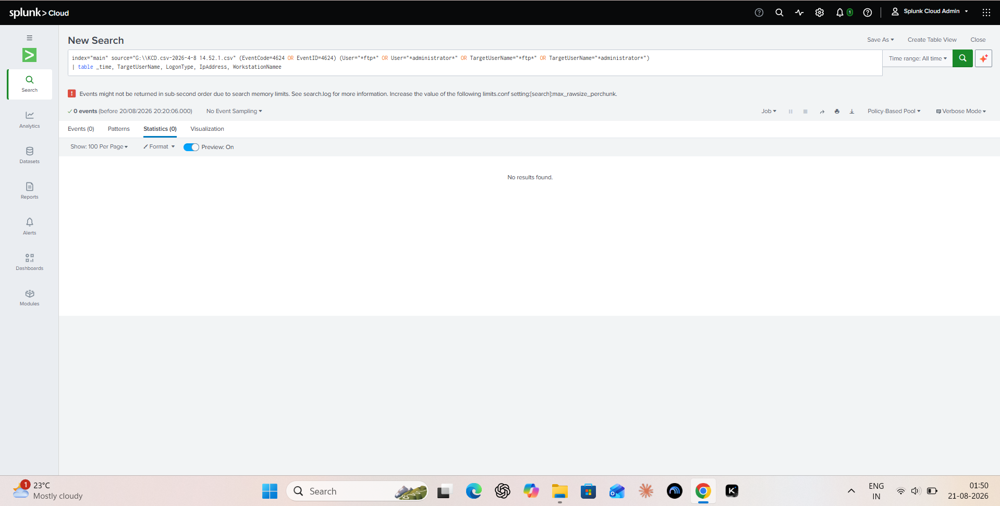

**Result:** 0 events. The Sysmon-only CSV export does not include Windows Security-log logon events (4624) — Sysmon doesn't natively log authentication. Access was instead correlated through Sysmon Network Connection (EventCode 3) and Process Creation (EventCode 1) data.

### Attacker RDP source IPs

```spl
index="main" source="G:\\KCD.csv-2026-4-8 14.52.1.csv" EventCode=3 DestinationPort=3389
| stats count by SourceIp
| sort - count
```

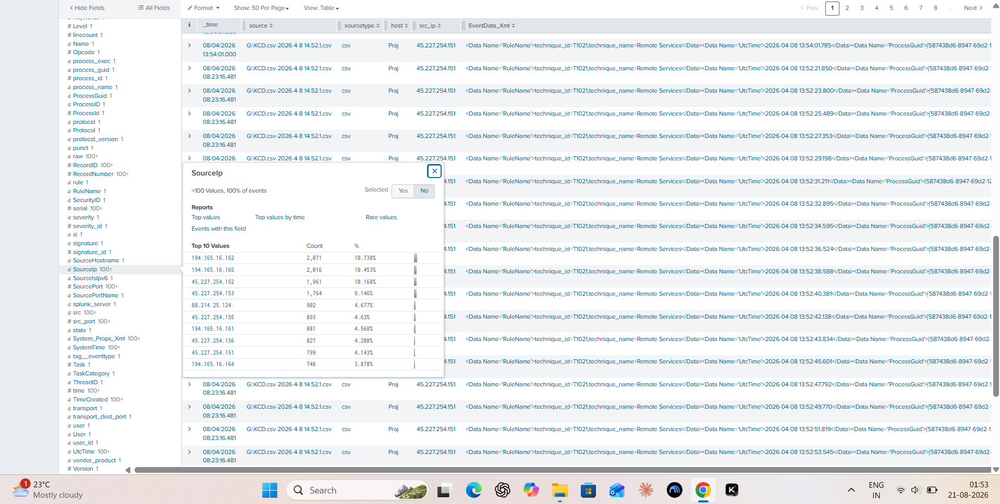

| SourceIp | Connection Count | Role |
|---|---|---|
| 45.227.254.151 | ~18,000+ | Primary RDP brute-force / access |
| 45.227.254.156 | ~1,000+ | Secondary RDP access |
| 79.127.147.207 | Few | Tertiary RDP access |

---

## PHASE 8 — Defense Evasion

**Objective:** find evidence of the attacker disabling defenses.

```spl
index="main" source="G:\\KCD.csv-2026-4-8 14.52.1.csv" EventCode=1 ParentImage="*powershell.exe*"
| table _time, User, Image, CommandLine
| sort _time
```

**Defense evasion commands executed (user: `KCD-Web\ftp$`):**

| Command | Purpose |
|---|---|
| `taskkill.EXE /im taskmgr.exe /f` | Kill Task Manager (hide from admins) |
| `taskkill.EXE /im prefmon.exe /f` | Kill Performance Monitor |
| `taskkill.EXE /im up.exe /f` | Kill competing malware/updater |
| `net stop "sysdiag"` | Stop Huorong Antivirus |
| `net stop "hrwfpdrv"` | Stop Huorong Firewall Driver |
| `sc delete "hrwfpdrv"` / `sc delete "sysdiag"` | Delete firewall/AV services |
| `reg delete "HKLM\...\Services\hrwfpdr" /f` / `sysdiag` | Remove firewall/AV registry keys |

---

## PHASE 9 — Payload Analysis: `waspwing.exe` Browser Farm

```spl
index="main" source="G:\\KCD.csv-2026-4-8 14.52.1.csv" EventCode=1 ParentImage="*wasp.exe*"
| table _time, User, Image, CommandLine
```

**Finding:** `wasp.exe` spawned dozens of `waspwing.exe` renderer processes:

```
waspwing.exe --type=renderer --no-sandbox --user-agent="Mozilla/5.0 (Windows NT 6.1; WOW64) AppleWebKit/537.36 Chrome/30.0.1599.101" --disable-webgl --disable-accelerated-video-decode
```

**Analysis:** a **headless Chromium browser farm** running as `SYSTEM`, used for automated session hijacking, credential scraping, and fraudulent web activity.

---

## 🗺️ Full Attack Timeline

| Time (UTC) | Phase | Actor/Process | Action |
|---|---|---|---|
| Apr 05, 10:40 | C2 Beaconing | `wahiver.exe` | Early beaconing to `178.248.233.33` |
| Apr 08, 03:18 | Initial Access | `administrator` | Interactive RDP session, opens PowerShell |
| Apr 08, 03:22 | Initial Access | `ftp$` | Interactive RDP session, opens PowerShell |
| Apr 08, 03:22 | Download | `powershell.exe` | Downloads payload from `82.147.85.6:80` |
| Apr 08, 03:23 | Staging | `p2.exe` | Drops `C:\Windows\Fonts\init\go.bat` |
| Apr 08, 03:24 | Staging | `deb.exe` / `ww.exe` | Drops `debug\go.bat` / `Fonts\w\go.bat` |
| Apr 08, 03:24 | Execution | `cmd.exe` → `go.bat` | Runs `svchost install WindowsDefend` |
| Apr 08, 03:24 | Persistence | `svchost.exe` (`ftp$`) | Creates `HKLM\...\Services\WindowsDefend` → `wahiver.exe` |
| Apr 08, 03:24 | Privilege Escalation | `services.exe` (SYSTEM) | Launches `svchost.exe run` → `wahiver.exe` |
| Apr 08, 03:24 | C2 | `wahiver.exe` | Connects to `185.213.157.164:10066` |
| Apr 08, 03:24 | Defense Evasion | `ftp$` via `cmd` | Kills `taskmgr`, stops/deletes `sysdiag` & `hrwfpdrv` |
| Apr 08, 03:59 | Staging | `b1.exe`, `u.exe` | Extracts SFX archives (Java JRE, brute tools, AlwaysUp) |
| Apr 08, 08:54 | Execution | `wahiver.exe` → `wasp.exe` | Launches infostealer with headless browser farm |
| Apr 08, 08:54+ | C2 | `wahiver.exe` | Continuous beaconing to multiple external IPs on port 80 |

**Total observed dwell time:** ≥ 3 days (first C2 beacon April 5 → discovery/analysis April 8).

---

## 📦 Indicators of Compromise

**Network:**

| IP Address | Port | Classification |
|---|---|---|
| 45.227.254.151 / .156 | 3389 | Attacker RDP source |
| 79.127.147.207 | 3389 | Attacker RDP source |
| 82.147.85.6 | 80 | Staging / download server |
| 185.213.157.164 | 10066 | Primary C2 |
| 178.248.233.33, 185.180.201.1, 89.221.239.1, 90.156.232.4, 93.186.225.194 | 80 | C2 / beaconing |
| 87.240.132.67 / .72 / .78, 87.240.129.133, 87.240.137.164 | 80 | C2 / beaconing (VKontakte range) |

**File hashes (SHA256):**

| File | SHA256 |
|---|---|
| `svchost.exe` (ServiceEx) | `9BD14131C0629461D045712A78F5ADFE64947C922577C924694A9B122BE28E70` |
| `wahiver.exe` | `AF60E17891BE5F4E6A777056F539B9ACFC4C695F7D781E131FD3F795EF0A60B9` |
| `wasp.exe` | `666959817A5A277B546DAD23B5317758AA6262FAC713A18267584B8105E86443` |

**File paths:** `C:\Windows\p2.exe`, `deb.exe`, `ww.exe`, `b1.exe`, `C:\Windows\fonts\b\u.exe`, `C:\Windows\Fonts\w\svchost.exe`, `C:\Windows\Fonts\w\go.bat`, `C:\Windows\Fonts\w\wa\wahiver.exe`, `wasp.exe`, `waspwing.exe`, `plc\*.dll`, `Temp\*`, `C:\Windows\Fonts\b\brute.properties`, `lib\jre1.8.0_162\*`, `C:\Windows\Fonts\u\AlwaysUpService.exe`, `C:\Windows\debug\go.bat`, `C:\Windows\Fonts\init\go.bat`.

**Registry:** `HKLM\System\CurrentControlSet\Services\WindowsDefend` (malicious service) → `Parameters\Application = C:\windows\fonts\w\wa\wahiver.exe`.

**Accounts:** `KCD-Web\ftp$` (primary attack account, FTP service abused), `KCD-Web\administrator` (interactive RDP session observed).

*(Full detail: [docs/ioc-list.md](docs/ioc-list.md))*

---

## 🛡️ MITRE ATT&CK Mapping

| Technique ID | Technique Name | Evidence |
|---|---|---|
| T1133 | External Remote Services | RDP from `45.227.254.x` |
| T1059.001 | PowerShell | Interactive download from `82.147.85.6` |
| T1059.003 | Windows Command Shell | `cmd.exe /c go.bat` |
| T1105 | Ingress Tool Transfer | SFX archives, PowerShell download |
| T1036 | Masquerading | `svchost.exe` in Fonts folder, "WindowsDefend" |
| T1574.002 | DLL Side-Loading | Unsigned ServiceEx binary |
| T1543.003 | Windows Service | `WindowsDefend` service creation |
| T1574.010 | Services File Permissions Weakness | File drops in Fonts directory |
| T1562.001 | Disable or Modify Tools | Killed `sysdiag`, `hrwfpdrv`, `taskmgr` |
| T1053 | Scheduled Task/Job | AlwaysUp service persistence |
| T1071.001 | Web Protocols (C2) | HTTP beaconing on port 80 |
| T1571 | Non-Standard Port (C2) | Port 10066 to `185.213.157.164` |
| T1027 | Obfuscated Files | IMPHASH all zeros (packed `wahiver.exe`) |
| T1055 | Process Injection | Chromium renderer abuse (`waspwing.exe`) |

*(Full detail: [docs/mitre-attack-mapping.md](docs/mitre-attack-mapping.md))*

---

## Disclaimer

This repository is for defensive threat-hunting/education/portfolio purposes. IOCs are shared to support blocking and detection; no malware binaries are included, only Sysmon telemetry and analysis.
